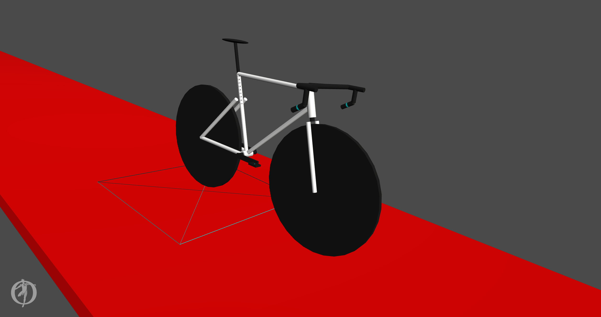

# opensim-model-bicycle

OpenSim bicycle model and example files.

| Author(s) | Brief Description | Intended Uses and Known Limitations | Included Material |
|-|-|-|-|
| Ross Wilkinson, Ph.D. | A 6-DoF bicycle model built for OpenSim. Despite the massless bodies, the frame geometry creates relatively accurate bicycle dynamics. Includes a DoF at each wheel, the cranks, and the steering tube. Built using MATLAB-OpenSim API. Contains contact geometries at the saddle, pedals, handlebar, and wheels. | Forward analyses of standing cycling in OpenSim. No drivetrain or coupling between crank and rear-wheel motion. Contact geometry of wheels needs to be changed from a single sphere to a series of spheres around tire surface. Bodies are currently massless. | Model file and MATLAB script to build and edit model parameters. |
